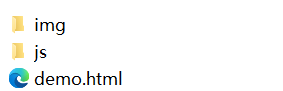
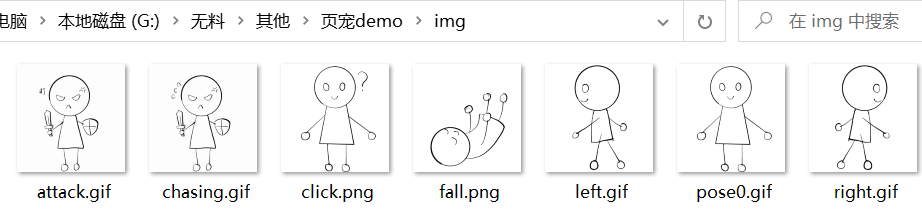
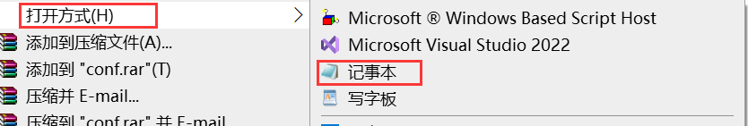
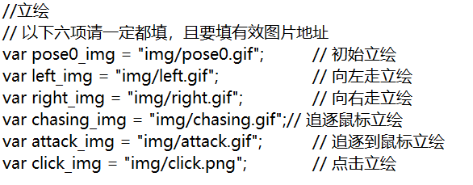
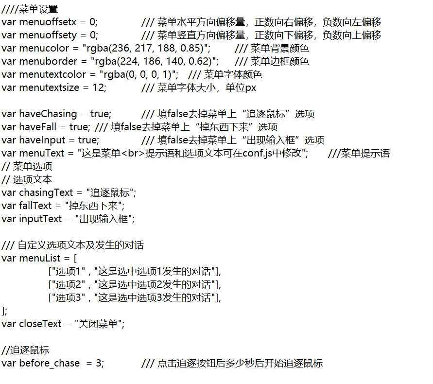
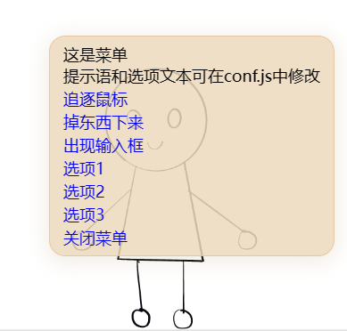

# pagePetDemo

一个简单的页面宠物小模板

[效果预览](https://sixwater6h2o.github.io/petDemo/index.html)

这个教程假设使用模板的人毫无代码基础，如果你对自己的代码能力有自信，欢迎随意对代码进行修改！

## 快速开始

### 1. 下载

github下载

百度网盘下载：

在修改模板过程中请保持各文件相对位置不变。

### 2. 修改模板

​		你至少需要修改的：

- `img`文件夹中的立绘
- `js/conf.js`中的立绘路径、菜单文字
- `js/talk.js`中的对话文本

  1. 在一切的开始，你需要一台**电脑**，手机和平板都无法继续操作。

     ​		将下载下来的压缩包解压到任意位置，在修改模板过程中请保持各文件相对位置不变。

     

  2. 解压后，你会得到这三个文件

     

     - `img`文件夹用于存放立绘

     - `js`文件夹用于存放脚本代码，我们主要修改`conf.js`和`talk.js`这两个文件，其他文件可以保持原样

     - 打开`demo.html`可以查看效果

       

  3. 首先，将你的立绘图片放进`img`文件夹，图片格式可以是png、jpg、gif甚至tiff（但推荐使用透明底）

     

     ​		命名格式无要求，如果担心接下来填写图片路径的时候出问题可以按照我的方式命名替换：

     - `attack`：追逐到鼠标后的立绘

     - `chasing`：追逐鼠标过程中的立绘

     - `click`：被点击的立绘

     - `fall`：掉落物的立绘

     - `left`：向左行走时的立绘

     - `right`：向右行走时的立绘

     - `pose0`：初始立绘

       **不要求**全部包括这些立绘，如果不担心太单调的话，全部使用一张图也是可以的。

       

  4. 打开`js`文件夹，**右键**点击`conf.js`，选择打开方式“记事本”

     

     

		5. 设置立绘

     ​		找到“立绘部分”，按照你的立绘图片名在对应行的**引号内**填写立绘路径（如果不知道什么是路径的话，就在`img/`斜杠后填图片名，**包括后缀**），**小心不要删掉引号**。

     ​		如果你只用了一张图片，六项填写同样的路径即可。但是**六项请一定都要填写**。

     

     

		6. 设置菜单

     ​		找到菜单设置部分。

     

     ​		按照需要设置菜单提示语、选项文本。比如可以设置是否添加“追逐鼠标”等选项。

     ​		需要多少其他选项和对应对话，在`menuList`的方括号中间模仿格式添加选项4567……即可，注意方括号、引号和逗号的位置。

     

		7. 根据个人需要修改`conf.js`中的其他设置。

		8. 同样使用记事本打开`talk.js`，按照提示修改对话文本

​		注：所有的对话如果需要换行，请在需要换行的位置插入` `，不要直接按换行键，否则会出现问题。

​		**简单来说，引号之间不要换行！！**

​		**引号之间不要换行！！！**

​		**引号之间不要换行！！！**

### 3. 运行

​		双击`demo.html`文件在浏览器中打开，如果前面没有问题的话，你推/OC会在浏览器底部走来走去了！

### 4. 可能的问题

#### Q1：为什么不显示立绘/对话/菜单？

A1：原因多种多样，需要具体问题具体分析，但简而言之，**有bug**。

​		可能是修改的时候不小心动了什么代码，可能是填写的有什么问题，可以在浏览器界面按下`f12`打开控制台查看报错信息。实在不行可以还原成初始版本，重新来一次（？

#### Q2：该如何将网页发布出去供别人浏览？

A2：双击打开`demo.html`文件启动的是单机版，如果想在手机上浏览或者让他人通过网址打开网页，需要自行发布。方法很多这里不做赘述，有兴趣的可以了解[使用GitHub Page创建个人网站和博客 | GitHub 中文社区 (github-zh.com)](https://www.github-zh.com/getting-started/github-pages)，或者干脆了解服务器建网页。

#### Q3：我可以对这个demo进行任意修改吗？我有想添加的其他功能。

A3：请随意！本人学艺不精可能会有各种bug，欢迎各位佬随意修改使用！但请不要拿来商用（真的有商用的价值吗）

#### Q4：你做这个的目的是什么？你的背后是什么人？（？）

A4：表面上的目的：搓个小玩具给大家玩。

​		实际上的目的：如果大家觉得我整了个好活的话能不能来看看我们《PPPPPP》（图穷匕见）。是被腰斩了的少年Jump漫画，70话完结，很好看的能不能看在孩子努力了的份上有空看我们pp一眼……（卑微）如果能给孩子做点pp饭的话那您将是我一生的恩人……（轻轻跪下）

一个视频了解我们6个p：

BV1ee4y1L7fR

【【公式】『PPPPPP』12月21日―ピアノの天才「音上」の家に七つ子が誕生した【JC最新5巻発売中】-哔哩哔哩】 https://b23.tv/rNBc5tl

## 参考

1. [桌面宠物 ② 通过js制作属于自己的web网页宠物_js 桌宠只做-CSDN博客](https://blog.csdn.net/zujiasheng/article/details/126711017)
2. [stevenjoezhang/live2d-widget: 把萌萌哒的看板娘抱回家 (ノ≧∇≦)ノ | Live2D widget for web platform (github.com)](https://github.com/stevenjoezhang/live2d-widget)